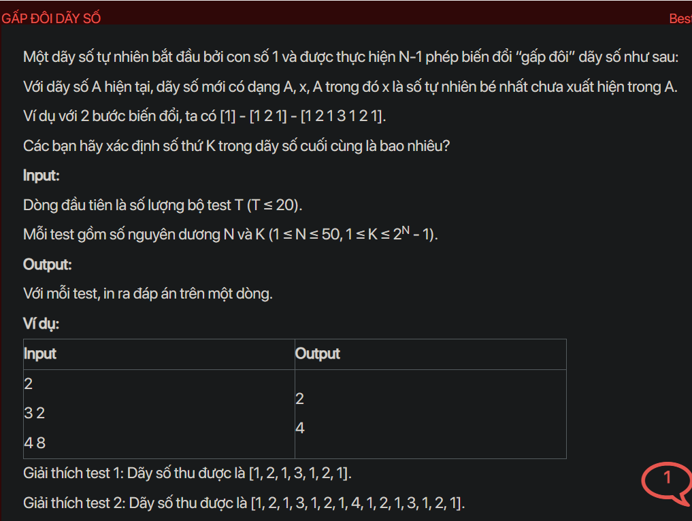

## dsa04004


## Approach
Problem Analysis:
The problem is asking to generate a sequence of numbers by repeatedly doubling the sequence and inserting a new smallest number that hasn't appeared in the sequence yet. The sequence starts with `1` and after `N-1` transformations, we need to find the `K-th` number in the sequence.

Solution:
The solution to this problem is to observe that the sequence always has the form `A, x, A` where `A` is the previous sequence and `x` is the new smallest number. This means that the sequence is symmetric and the middle number is always the largest number. So, we can find the `K-th` number by recursively dividing the sequence into two halves. If `K` is in the left half, we continue with the left half. If `K` is in the right half, we continue with the right half and adjust `K` accordingly. If `K` is in the middle, we return the largest number.

Here are the steps in detail:

1. Read the number of test cases `T`.
2. For each test case, do the following:
   1. Read `N` and `K`.
   2. Call a recursive function `findNumber` with `N` and `K` to find the `K-th` number.
   3. Print the `K-th` number.

Implementation in C++:

```cpp
#include <iostream>
using namespace std;

int findNumber(int N, long long K) {
    long long mid = (1LL << N) / 2;
    if (K == mid) {
        return N;
    } else if (K < mid) {
        return findNumber(N - 1, K);
    } else {
        return findNumber(N - 1, K - mid);
    }
}

void testCase() {
    int N;
    long long K;
    cin >> N >> K;
    cout << findNumber(N, K) << "\n";
}

int main() {
    int T;
    cin >> T;
    while (T--) {
        testCase();
    }
    return 0;
}
```

Time Complexity Analysis:
The time complexity of this solution is O(N) for each test case because we are recursively dividing the sequence into two halves until we find the `K-th` number. The total time complexity is O(T*N) where T is the number of test cases and N is the maximum number of transformations.