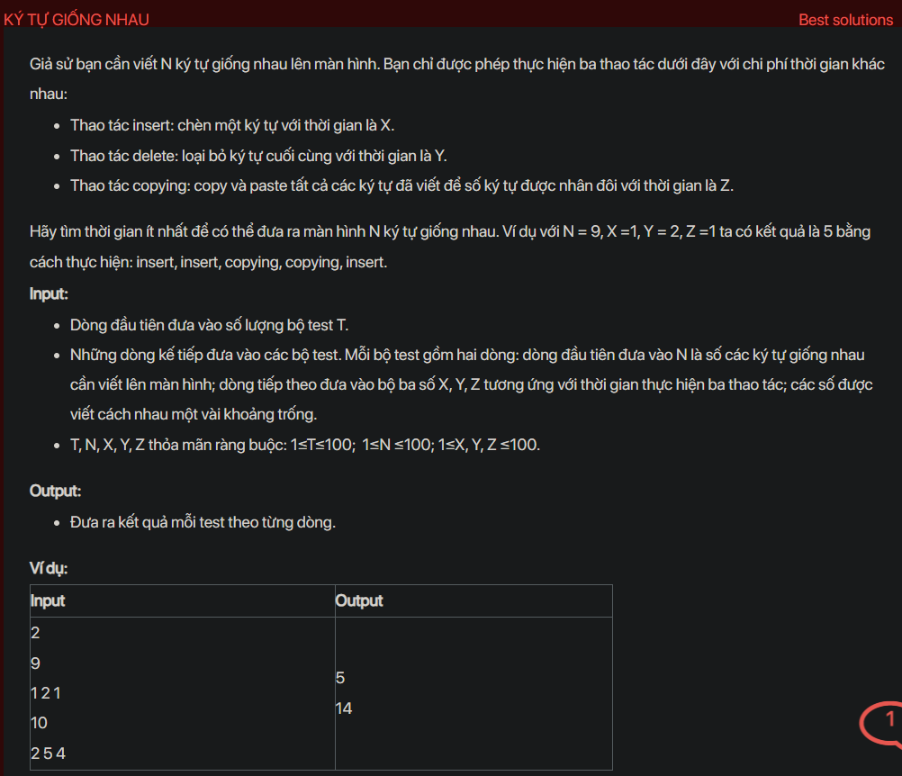

## dsa05022

## Approach
Problem Analysis:
The problem is asking to find the minimum time to write N identical characters on the screen. We can perform three operations: insert a character with time X, delete the last character with time Y, and copy and paste all written characters to double the number of characters with time Z.

Solution Analysis:
We can solve this problem using dynamic programming. We maintain an array `dp` where `dp[i]` is the minimum time to write `i` characters. We can fill this array by considering all possible operations. If we can double the number of characters, we choose the minimum between the current value and the time to double plus the time to delete the extra characters. If we can't double the number of characters, we add a character.

Implementation in C++:

```cpp
#include<bits/stdc++.h>
using namespace std;

int minTime(int N, int X, int Y, int Z) {
    vector<int> dp(N+1, INT_MAX);
    dp[1] = X;
    for (int i = 2; i <= N; i++) {
        if (i % 2 == 0)
            dp[i] = min(dp[i], min(dp[i-1] + X, dp[i/2] + Z));
        else
            dp[i] = min(dp[i], min(dp[i-1] + X, dp[i/2 + 1] + Z + Y));
    }
    return dp[N];
}

int main() {
    int T;
    cin >> T;
    while (T--) {
        int N, X, Y, Z;
        cin >> N >> X >> Y >> Z;
        cout << minTime(N, X, Y, Z) << endl;
    }
    return 0;
}
```

Time Complexity Analysis:
The time complexity of the above solution is O(N) because we use a single loop to fill the `dp` array. The space complexity is O(N) for the `dp` array.

## Explain
Test có TH n = 1
Bài toán cơ sở: f[0] = 0, f[1] = insert (luôn luôn bắt đầu từ insert)

Với n lẻ có thể được biến đổi bằng 3 cách tốn ít chi phí nhất:
+ f[n - 1] -> insert
+ f[(n - 1) / 2] -> copy -> insert
+ f[(n + 1) / 2] -> copy -> delete

Với n chẵn có thể được biến đổi bằng 2 cách tốn ít chi phí nhất:
+ f[n - 1] -> insert
+ f[n / 2] -> copy