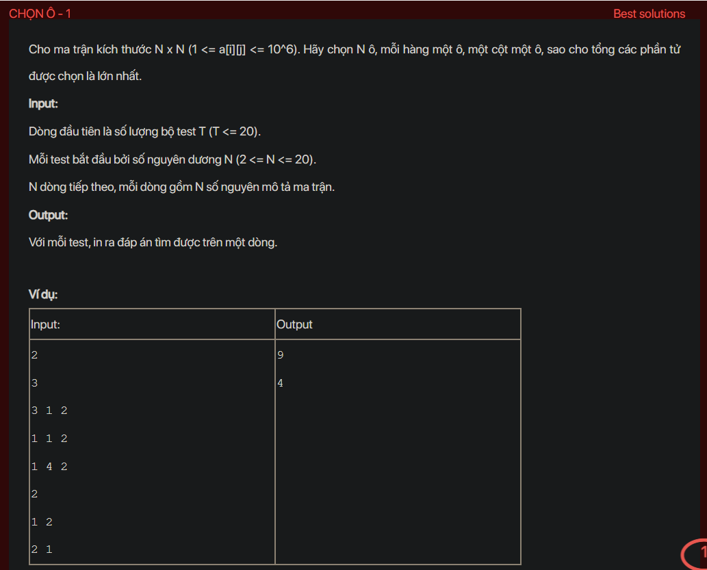

## dsap039

## Approach
Sure, let's break down the algorithm in detail:

The problem is to select N cells from an N x N matrix such that each row and each column is represented exactly once and the sum of the selected cells is maximized. 

The algorithm uses a technique called Dynamic Programming (DP), which is a method for solving complex problems by breaking them down into simpler subproblems. It is applicable when the subproblems are not independent, i.e., when the solution to one subproblem can be used to solve other subproblems.

The algorithm uses a 2D DP array, `dp[i][mask]`, where `i` is the current row and `mask` is a binary number representing the columns from which we have selected the cells. If the jth bit in the mask is set, it means that a cell from the jth column has been selected.

The function `solve(int i, int mask)` calculates the maximum sum we can get by selecting cells from the ith row onwards. The base case for the function is when `i == n`, i.e., we have reached the last row, in which case it returns 0 as there are no more cells to select.

If `dp[i][mask]` is not -1, it means we have already computed the maximum sum for this state, so we return its value.

Otherwise, we initialize `ans` to 0 and iterate over each column `j`. If the jth bit in the mask is not set (which means a cell from the jth column has not been selected yet), we make a recursive call to `solve(i + 1, mask | (1 << j))`. Here, `mask | (1 << j)` sets the jth bit in the mask, indicating that we have selected a cell from the jth column. We add `arr[i][j]` to the result of the recursive call, which represents the value of the cell (i, j). We update `ans` with the maximum value obtained.

Finally, we update `dp[i][mask]` with the value of `ans` and return it. This represents the maximum sum we can get by selecting cells from the ith row onwards, given that the columns represented by the mask have been selected.

In the `main()` function, we read the number of test cases and for each test case, we read the matrix, initialize the DP array to -1, and print the result of `solve(0, 0)`, which represents the maximum sum we can get by selecting cells from the first row onwards, given that no column has been selected yet.