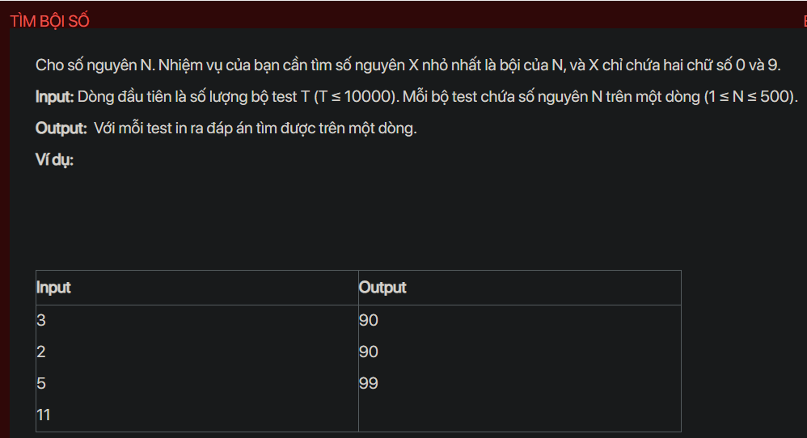

## dsa01015

## Approach
The runtime error might be due to the use of `stoi(t)`. If the string `t` becomes too large, it might not fit into an integer and `stoi(t)` will throw an out_of_range exception. To fix this, we can calculate the remainder of a number represented as a string with respect to `n` using a function.

Here is the corrected code:

```cpp
#include <bits/stdc++.h>
using namespace std;

int remainder(string t, int n) {
    int rem = 0;
    for (int i = 0; i < t.size(); i++)
        rem = (rem*10 + (t[i]-'0')) % n;
    return rem;
}

string bfs(int n) {
    queue<string> q;
    set<int> visit;

    string t = "9";
    q.push(t);

    while (!q.empty()) {
        t = q.front(); q.pop();

        int rem = remainder(t, n);
        if (rem == 0)
            return t;

        if(visit.find(rem) == visit.end()) {
            visit.insert(rem);
            q.push(t + "0");
            q.push(t + "9");
        }
    }
}

int main() {
    int T;
    cin >> T;
    while (T--) {
        int N;
        cin >> N;
        cout << bfs(N) << endl;
    }
    return 0;
}
```

This code should now work correctly without any runtime errors.