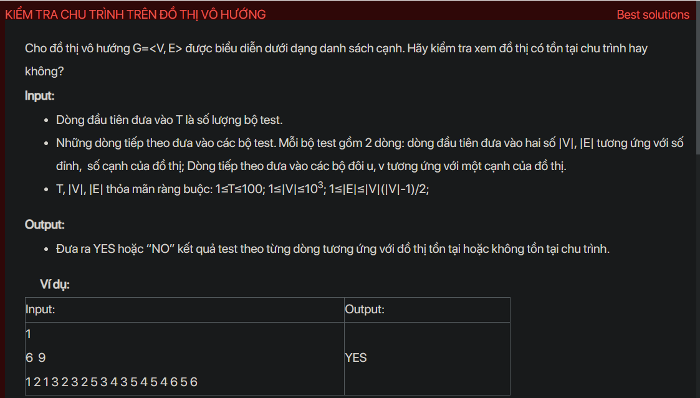

## dsa09014

## Approach
Problem Analysis:
The problem is about detecting a cycle in an undirected graph. A cycle exists in a graph if there is a back edge present in the graph. A back edge is an edge that is joining a node to itself (self-loop) or one of its ancestors in the tree produced by DFS.

Solution Analysis:
We can use Depth-First Search (DFS) to detect a cycle in a Graph. DFS will start from every unvisited node. DFS calls itself recursively for every unvisited node. When recursive DFS call returns, if the returned value is true, then Graph contains a cycle, otherwise we continue to next unvisited node.

Implementation in C++:

```cpp
#include<bits/stdc++.h>
using namespace std;

bool isCyclicUtil(vector<int> adj[], int v, bool visited[], int parent) {
    visited[v] = true;
    for (int i = 0; i < adj[v].size(); ++i) {
        int neighbour = adj[v][i];
        if (!visited[neighbour]) {
           if (isCyclicUtil(adj, neighbour, visited, v))
              return true;
        }
        else if (neighbour != parent)
           return true;
    }
    return false;
}

bool isCyclic(vector<int> adj[], int V) {
    bool *visited = new bool[V];
    for (int i = 0; i < V; i++)
        visited[i] = false;
    for (int u = 0; u < V; u++) {
        if (!visited[u])
          if (isCyclicUtil(adj, u, visited, -1))
             return true;
    }
    return false;
}

int main() {
    int T;
    cin >> T;
    while (T--) {
        int V, E;
        cin >> V >> E;
        vector<int> adj[V];
        for (int i = 0; i < E; i++) {
            int u, v;
            cin >> u >> v;
            adj[u-1].push_back(v-1);
            adj[v-1].push_back(u-1);
        }
        if (isCyclic(adj, V))
            cout << "YES" << endl;
        else
            cout << "NO" << endl;
    }
    return 0;
}
```

Time Complexity Analysis:
The time complexity of the solution is O(V+E) where V is the number of vertices and E is the number of edges in the graph. This is because we are using DFS traversal. The space complexity is O(V) for storing visited information.