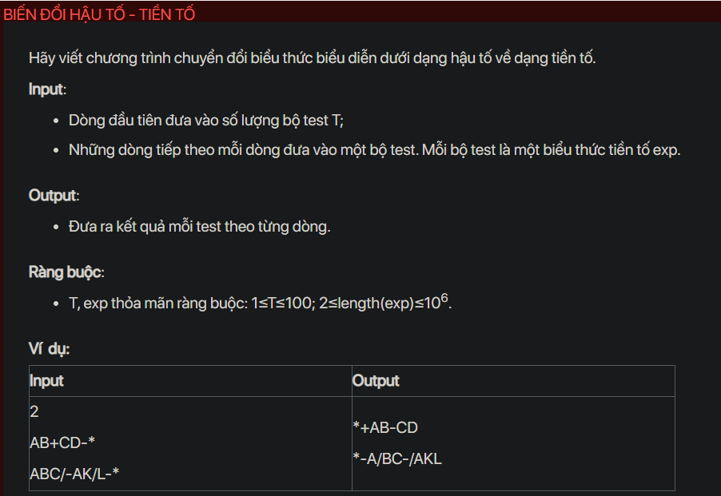

## dsa07011

## Approach
Problem Analysis:
The problem is asking to convert a postfix expression to a prefix expression.

Postfix expression is the expression in which the operator is followed by operands, i.e., `operand1 operand2 operator`

Prefix expression is the expression in which the operator is followed by operands, i.e., `operator operand1 operand2`

Solution Analysis:
We can solve this problem using a stack. The idea is to iterate over the postfix expression and do the following for every character:

- If the character is an operand, push it to the stack.
- If the character is an operator, then pop two operands from the stack, create a string by concatenating the operator, the second operand, and the first operand, in this order, and push the resulting string back to the stack.

After the postfix expression is completely processed, the stack should contain a single string which is the prefix expression.

Implementation in C++:

```cpp
#include<bits/stdc++.h>
using namespace std;

bool isOperator(char x) {
    switch (x) {
        case '+':
        case '-':
        case '/':
        case '*':
            return true;
    }
    return false;
}

string postfixToPrefix(string s) {
    stack<string> st;
    int length = s.size();
    for (int i = 0; i < length; i++) {
        if (isOperator(s[i])) {
            string op1 = st.top(); st.pop();
            string op2 = st.top(); st.pop();
            string temp = s[i] + op2 + op1;
            st.push(temp);
        } else {
            st.push(string(1, s[i]));
        }
    }
    return st.top();
}

int main() {
    int T;
    cin >> T;
    while (T--) {
        string s;
        cin >> s;
        cout << postfixToPrefix(s) << endl;
    }
    return 0;
}
```

Time Complexity Analysis:
The time complexity of the above solution is O(N) because we use a single loop to iterate over the string. The space complexity is O(N) for the stack.