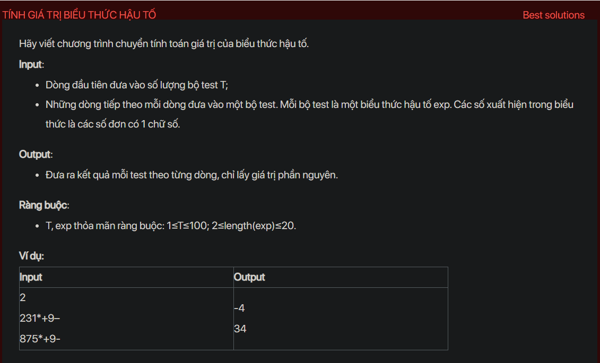

## dsa07013


## Approach
**Problem Analysis:**

The problem is asking to evaluate a postfix expression. In postfix notation, the operator is placed after the operands.

**Solution Analysis:**

We can solve this problem by using a stack. We iterate the postfix expression from left to right. If the current character is an operand, we push it into the stack. If the current character is an operator, we pop two operands from the stack, perform the operation, and push the result back into the stack. At the end, the stack should contain a single element which is the result of the expression.

**Implementation in C++:**

```cpp
#include<bits/stdc++.h>
using namespace std;

bool isOperator(char x) {
    switch (x) {
        case '+':
        case '-':
        case '/':
        case '*':
            return true;
    }
    return false;
}

int evaluatePostfix(string exp) {
    stack<int> s;
    for (int i = 0; i < exp.size(); i++) {
        if (isOperator(exp[i])) {
            int op2 = s.top(); s.pop();
            int op1 = s.top(); s.pop();
            switch (exp[i]) {
                case '+': s.push(op1 + op2); break;
                case '-': s.push(op1 - op2); break;
                case '*': s.push(op1 * op2); break;
                case '/': s.push(op1 / op2); break;
            }
        } else {
            s.push(exp[i] - '0');
        }
    }
    return s.top();
}

int main() {
    int T;
    cin >> T;
    while (T--) {
        string exp;
        cin >> exp;
        cout << evaluatePostfix(exp) << endl;
    }
    return 0;
}
```

**Time Complexity Analysis:**

The time complexity of the solution is O(n) where n is the length of the postfix expression. This is because we are iterating through the postfix expression once. The space complexity is also O(n) for the stack.